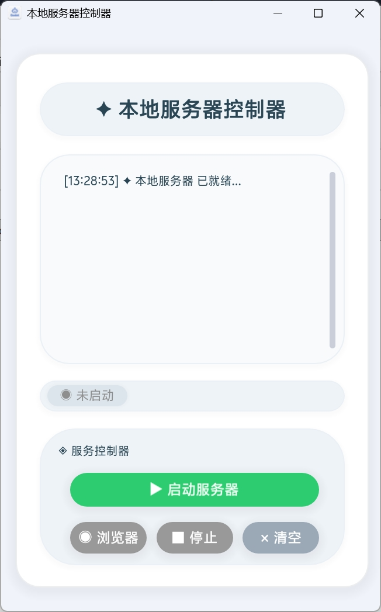
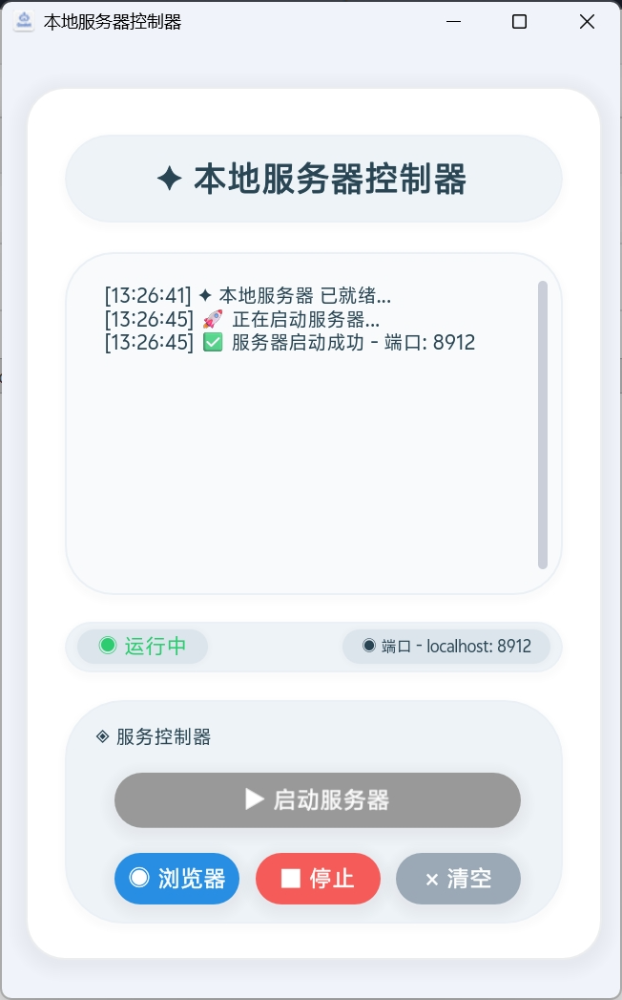

---

# LocalServer-Godot-4

一个轻量级的本地HTTP文件服务器控制器，专为Godot 4 Web导出项目设计，是 `python -m http.server` 的图形化平替方案。

## 📸 项目截图

| 截图1 | 截图2 |
|:---:|:---:|
|  |  |


## 特性

- ✅ **无需Python环境** - 基于Windows原生PowerShell + .NET实现
- ✅ **图形化控制** - 一键启动/停止/打开浏览器
- ✅ **自动端口分配** - 随机生成可用端口 (8888-9888)
- ✅ **独立进程运行** - 不阻塞Godot主界面
- ✅ **目录浏览支持** - 自动显示index.html或目录列表
- ✅ **适合Godot Web预览** - 解决导出后无法双击运行的痛点

## 快速开始

1. 将项目添加到您的Godot 4工程中
2. 导出Web版本到 `user://` 目录
3. 启动工具，点击「启动」按钮
4. 自动打开浏览器预览游戏

## 技术架构

```
┌─────────────────────────────────────────────┐
│           View层 (main.gd)                  │
│   Godot图形界面 - 状态/按钮/日志            │
└─────────────────────────────────────────────┘
                    │
                    ▼
┌─────────────────────────────────────────────┐
│        Controller层 (ServerController.gd)   │
│   生成脚本 / 进程管理 / PID信号控制         │
└─────────────────────────────────────────────┘
                    │
                    ▼
┌─────────────────────────────────────────────┐
│          Model层 (ServerData.gd)            │
│   PowerShell + HttpListener HTTP服务器      │
└─────────────────────────────────────────────┘
```

## 系统要求

- Windows操作系统
- Godot 4.x
- 无需额外安装任何软件

## 对比python -m http.server

| 功能 | python -m http.server | 本工具 |
|------|----------------------|--------|
| 需要Python环境 | ✅ 需要 | ❌ 不需要 |
| 图形界面控制 | ❌ | ✅ |
| 一键启动/停止 | ❌ | ✅ |
| 一键打开浏览器 | ❌ | ✅ |
| 进程自动管理 | ❌ | ✅ |

## 文件说明

工具在 `user://` 目录下生成以下文件：

| 文件 | 用途 |
|------|------|
| `server.ps1` | HTTP服务器主脚本 |
| `quit.ps1` | 停止脚本 |
| `server.pid` | PID记录文件（停止信号） |

## 已知限制

- 仅支持Windows系统
- 仅支持HTTP协议（适合本地预览）
- 纯静态文件服务，不支持PHP/动态页面

## License

MIT License

---

## 版本历史

### v1.1 (2026-08-20)
- 修复工作目录处理逻辑
- 优化进程管理机制
- 移除不必要的参数传递

---
